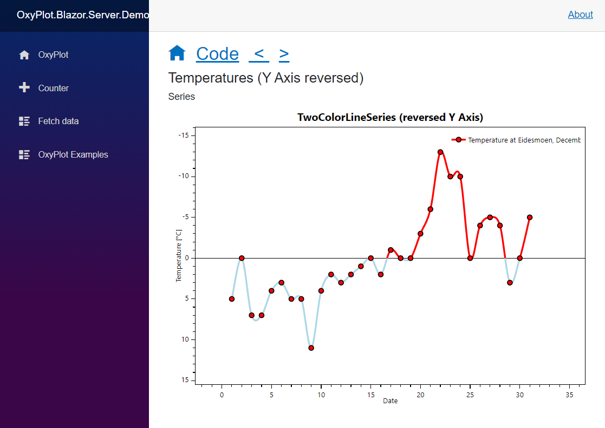

# OxyPlot.Blazor.BlazorPlotView Component



## Requirements

- dot net 6.0 / net 7.0

## Usage

Add Package Reference to OxyPlot.Core
Add `OxyPlot.Blazor` library

add OxyPlotServices in Program.cs 
```cs
var builder = WebApplication.CreateBuilder(args);

// Add services to the container.
builder.Services.AddRazorPages();
builder.Services.AddServerSideBlazor();
builder.Services.AddSingleton<WeatherForecastService>();
// add OxyPlot.Blazor scripting
builder.Services.AddOxyPlotBlazor();

var app = builder.Build();
```

```razor
@using OxyPlot.Blazor
<BlazorPlotView Width="100%" Height="30vh" Model="_model" />
@code {
	PlotModel _model = ... // some model
}
```


## Known issues

- Images anoations don't work yet (I do not understand that, they are just not visible)
- Tracker is an extra `<div/>` - not pretty, only shown, when Parameter `TrackerEnabled` is set to true